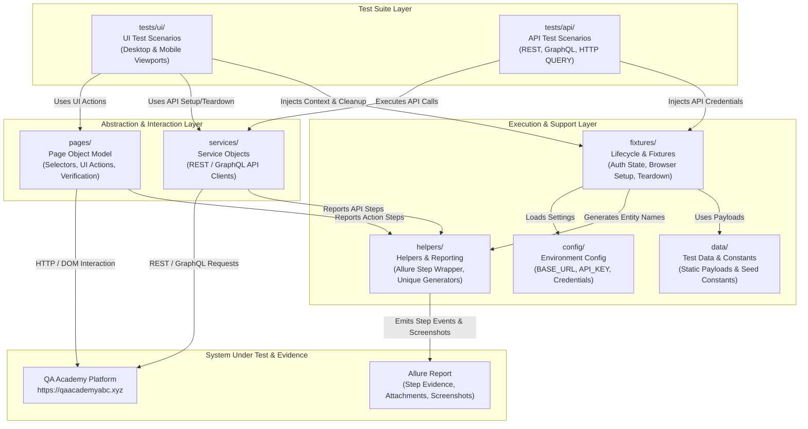

# Framework Architecture & Technical Design

This document details the multi-framework test architecture implemented in `qa-academy-exercises` for the QA Academy Platform (`https://qaacademyabc.xyz`).

---

## 1. Multi-Framework Architecture Overview

The repository contains **four automation projects** designed to showcase identical testing logic, assertions, and Allure step reporting across four modern technology stacks:

1. **`typescript-playwright`**: TypeScript + Playwright Test + Playwright APIRequestContext
2. **`typescript-cypress`**: TypeScript + Cypress + `cy.request()`
3. **`python-playwright`**: Python 3.12 + Pytest + Playwright sync API
4. **`java-selenium-rest-assured`**: Java 21 + Selenium WebDriver + REST Assured + JUnit 5

Each framework is structured into **8 standardized responsibility layers** to guarantee modularity, maintainability, and clean separation of concerns.

---

## 2. Mermaid Architecture Diagram

The diagram below visualizes the 8-layer architecture, data flow, page object interaction, service calls, and reporting pipeline shared across all 4 frameworks:

---

## 3. The 8 Responsibility Layers

| Layer | Path | Description & Responsibilities |
|---|---|---|
| **1. UI Tests** | `tests/ui` | End-to-end user interface test scenarios. Orchestrates page workflows and asserts UI states on both desktop and mobile viewports. |
| **2. API Tests** | `tests/api` | REST API, GraphQL, and HTTP `QUERY` test scenarios. Validates endpoint contracts, status codes, payload schemas, and headers. |
| **3. Page Objects** | `pages` | Encapsulates page selectors, UI element locators, and user interaction methods. Does not contain hardcoded test assertions. |
| **4. Service Objects** | `services` | Encapsulates HTTP client interactions (GET, POST, PATCH, DELETE, QUERY, GraphQL). Manages request headers and payload serialization. |
| **5. Fixtures** | `fixtures` | Manages test setup, browser context creation, authenticated state injection, dependency injection, and teardown cleanup. |
| **6. Helpers** | `helpers` | Common utilities including Allure step reporting wrappers (`step()`), unique test name generators (`uniqueProductName()`), and incident loggers. |
| **7. Data** | `data` | Static test constants, teaching data definitions, purchase quantities, and payload builder templates. |
| **8. Config** | `config` | Environment variables loader (`BASE_URL`, `API_KEY`, `UI_EMAIL`, `UI_PASSWORD`, `VERCEL_AUTOMATION_BYPASS_SECRET`, `DEVICE_PROFILE`). |

---

## 4. Key Architectural Patterns

### Authentication State Injection & Credential Management
Credentials (`API_KEY`, `UI_EMAIL`, `UI_PASSWORD`) are loaded strictly from environment variables or GitHub secret stores. They are **never hardcoded or committed** to repository files:
- `localStorage.api_token` = `API_KEY`
- `localStorage.user_email` = `UI_EMAIL`
- `localStorage['qa-academy-terms-consent-v1']` = `'accepted'`

### Data Isolation & Guaranteed Teardown
To prevent test pollution and interference:
- Entities are created with unique timestamped identifiers (`uniqueProductName()`).
- Setup & teardown blocks (`try...finally` in TS/Python/Java, `afterEach` in Cypress) ensure created orders, cart items, and products are deleted via API cleanup calls regardless of test success or failure.

### Unified Allure Step Catalog
Every action, navigation, and assertion emits a standardized Allure step label. When a test fails, the Allure report pinpoints the exact step that failed without obscuring the failure context.

---

## 5. Framework Execution Matrix & CI Pipeline

All 4 frameworks are executed sequentially in GitHub Actions (`.github/workflows/frameworks-ci.yml`) using `max-parallel: 1` to ensure tests do not compete for shared environment state.

| Project | UI Tool | API Tool | Book Tests | Extended Tests | Total Executions |
|---|---|---|---:|---:|---:|
| `typescript-playwright` | Playwright | APIRequestContext | 4 | 73 | **77** |
| `python-playwright` | Playwright | APIRequestContext | 4 | 73 | **77** |
| `java-selenium-rest-assured` | Selenium | REST Assured | 4 | 73 | **77** |
| `typescript-cypress` | Cypress | `cy.request()` | 4 | 16 | **20** |

---

## 6. Modular Automation Bypass & Public Execution Policy

### Modular Bypass Header Handling
All four frameworks implement **modular Vercel automation bypass logic**:
- **Bypass Present**: If `VERCEL_AUTOMATION_BYPASS_SECRET` is set in `.env` or CI environment, the framework context automatically attaches the deployment protection headers:
  - `x-vercel-protection-bypass: <SECRET>`
  - `x-vercel-set-bypass-cookie: true`
- **Bypass Omitted**: If `VERCEL_AUTOMATION_BYPASS_SECRET` is empty or omitted, these headers are dynamically omitted from all HTTP/browser contexts.

> [!IMPORTANT]
> **Book Tests vs. Extended Suite Execution Policy:**
> 1. **Book Tests (4 Scenarios)**: `BOOK-TEST-UI-001` (Desktop), `BOOK-TEST-UI-001` (Mobile), `BOOK-TEST-UI-002`, and `BOOK-TEST-API-001` NEVER send bypass headers and can ALWAYS be executed together in full without issue.
> 2. **Extended Suite (73 Scenarios)**: Attempting to run all 73 extended tests simultaneously in public environments without `VERCEL_AUTOMATION_BYPASS_SECRET` will trigger hosted Vercel traffic protection and rate-limiting. This will cause edge challenges and throttling, creating a **false perception that tests are flaky**.
> 3. **Public Learners Execution**: Without the bypass secret, public users must run extended tests **1 test at a time** (or max batch of 1–3 tests filtered by Test ID) per command. Full extended suite execution is reserved for internal maintainers with `VERCEL_AUTOMATION_BYPASS_SECRET`.
